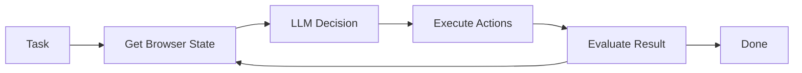

## Overview

The `Agent` class is the core orchestrator of Browser Use. It combines an LLM with browser automation tools to autonomously complete web tasks. The agent follows a continuous loop of observing the browser state, reasoning about the next action, executing it, and evaluating the result.

## Architecture

The agent operates in a multi-step execution loop:



### Key Components

<CardGroup cols={2}>
  <Card title="Message Manager" icon="messages">
    Manages conversation history and context sent to the LLM
  </Card>
  <Card title="Tools Registry" icon="wrench">
    Available browser actions the agent can perform
  </Card>
  <Card title="State Manager" icon="database">
    Tracks execution state, failures, and planning
  </Card>
  <Card title="Token Cost Service" icon="coins">
    Monitors and calculates API usage costs
  </Card>
</CardGroup>

## Creating an Agent

### Basic Example

```python
from browser_use import Agent, ChatBrowserUse

agent = Agent(
    task="Find the top post on Hacker News",
    llm=ChatBrowserUse(),
)

# Run the agent
history = await agent.run(max_steps=100)
```

### With Custom Browser

```python
from browser_use import Agent, Browser, ChatOpenAI

browser = Browser(
    headless=False,
    window_size={'width': 1280, 'height': 720},
)

agent = Agent(
    task="Search for Python tutorials and extract the first 5 results",
    llm=ChatOpenAI(model='gpt-4.1-mini'),
    browser=browser,
)

history = await agent.run()
```

## Agent Lifecycle

### Initialization (`__init__`)

When you create an agent (line 134 in `agent/service.py`):

1. **LLM Setup**: Validates and configures the language model
2. **Browser Session**: Creates or connects to a browser instance
3. **Tools Registration**: Sets up available actions
4. **State Initialization**: Prepares execution state tracking
5. **Message Manager**: Configures prompt management
6. **File System**: Sets up temporary workspace

<Note>
The agent automatically detects the optimal configuration based on your LLM choice. For example, Claude Sonnet models automatically enable coordinate clicking and optimize screenshot sizes.
</Note>

### Execution Loop

The `step()` method (line 1019 in `agent/service.py`) executes one iteration:

<Tabs>
  <Tab title="Phase 1: Context Preparation">
    ```python
    # Get current browser state
    browser_state = await browser.get_browser_state_summary(
        include_screenshot=True,
        include_recent_events=True
    )
    
    # Check for new downloads
    await agent._check_and_update_downloads()
    
    # Update available actions for current page
    await agent._update_action_models_for_page(url)
    ```
  </Tab>
  
  <Tab title="Phase 2: LLM Decision">
    ```python
    # Prepare messages with browser state
    messages = message_manager.get_messages()
    
    # Call LLM with timeout
    model_output = await llm.ainvoke(
        messages, 
        output_format=AgentOutput,
        timeout=llm_timeout
    )
    
    # Handle callbacks
    await register_new_step_callback(browser_state, model_output, step)
    ```
  </Tab>
  
  <Tab title="Phase 3: Action Execution">
    ```python
    # Execute actions from model output
    for action in model_output.actions:
        result = await tools.execute_action(action)
        
        if result.error:
            agent.state.consecutive_failures += 1
        else:
            agent.state.consecutive_failures = 0
    ```
  </Tab>
  
  <Tab title="Phase 4: Post-Processing">
    ```python
    # Update plan state
    agent._update_plan_from_model_output(model_output)
    
    # Record for loop detection
    agent._update_loop_detector_actions()
    
    # Save to history
    history.add_step(browser_state, model_output, result)
    ```
  </Tab>
</Tabs>

## Agent State Management

The agent maintains state across steps through `AgentState` (line 250 in `agent/views.py`):

```python
class AgentState(BaseModel):
    agent_id: str
    n_steps: int
    consecutive_failures: int
    last_result: list[ActionResult] | None
    plan: list[PlanItem] | None
    current_plan_item_index: int
    last_model_output: AgentOutput | None
    paused: bool
    stopped: bool
    loop_detector: ActionLoopDetector
    message_manager_state: MessageManagerState
    file_system_state: FileSystemState | None
```

### State Persistence

You can save and restore agent state:

```python
# Save state
agent_state = agent.state
state_dict = agent_state.model_dump()

# Later, restore state
from browser_use.agent.views import AgentState
restored_state = AgentState(**state_dict)

new_agent = Agent(
    task="Continue previous task",
    llm=llm,
    injected_agent_state=restored_state,
)
```

## Planning System

Agents can maintain multi-step plans when `enable_planning=True` (default):

<Info>
The planning system helps agents break down complex tasks into smaller steps and track progress.
</Info>

```python
agent = Agent(
    task="Research competitors and create a comparison table",
    llm=llm,
    enable_planning=True,
    planning_replan_on_stall=3,  # Replan after 3 consecutive failures
    planning_exploration_limit=5,  # Nudge to create plan after 5 steps
)
```

**Planning Features:**
- **Automatic plan generation**: Agent creates step-by-step plans
- **Progress tracking**: Monitors completion of each plan item
- **Dynamic replanning**: Adjusts plan when stuck or failing
- **Exploration nudges**: Encourages planning after wandering

## Loop Detection

The agent includes sophisticated loop detection (line 156 in `agent/views.py`):

```python
class ActionLoopDetector:
    window_size: int = 20  # Rolling window of recent actions
    recent_action_hashes: list[str]  # Normalized action hashes
    recent_page_fingerprints: list[PageFingerprint]
    max_repetition_count: int
    consecutive_stagnant_pages: int
```

**Detection Triggers:**
- **Action repetition**: Same action repeated 5+ times
- **Page stagnation**: Page unchanged for 5+ consecutive actions
- **Escalating nudges**: Gentle warnings at 5, 8, and 12 repetitions

Example nudge message:
> "Heads up: you have repeated a similar action 8 times in the last 20 actions. Are you still making progress with each attempt?"

## Advanced Features

### Thinking Mode

Enable internal reasoning for better decision making:

```python
agent = Agent(
    task="Complex multi-step task",
    llm=llm,
    use_thinking=True,  # Agent shows reasoning process
)
```

When enabled, each step includes the agent's thought process:
- Evaluation of previous action's success
- Current memory/context
- Next goal and reasoning

### Flash Mode

Optimize for speed by disabling evaluation and planning:

```python
agent = Agent(
    task="Quick lookup task",
    llm=llm,
    flash_mode=True,  # Faster execution, less overhead
)
```

<Warning>
Flash mode disables `use_thinking`, planning, and evaluation. Only use for simple, straightforward tasks.
</Warning>

### Vision Control

Configure how the agent processes visual information:

```python
agent = Agent(
    task="Visual task",
    llm=llm,
    use_vision='auto',  # Options: True, False, 'auto'
    vision_detail_level='high',  # Options: 'low', 'high', 'auto'
    llm_screenshot_size=(1400, 850),  # Resize for LLM efficiency
)
```

## Error Handling

The agent includes robust error handling:

```python
agent = Agent(
    task="Task that might fail",
    llm=llm,
    max_failures=5,  # Retry limit before giving up
    final_response_after_failure=True,  # Attempt final output after max failures
    fallback_llm=ChatOpenAI(model='gpt-4.1-mini'),  # Fallback model if primary fails
)
```

### Failure Recovery

When errors occur:
1. **Retry with context**: Error details added to next LLM call
2. **Consecutive failure tracking**: Monitors repeated failures
3. **Fallback LLM**: Switches to backup model if configured
4. **Final response**: Attempts structured output even after max failures

## Agent Hooks

Implement custom logic at key points:

```python
async def on_new_step(browser_state, agent_output, step_number):
    print(f"Step {step_number}: {agent_output.current_state.next_goal}")
    # Custom logging, analytics, etc.

async def on_done(history):
    print(f"Task completed in {history.number_of_steps()} steps")
    # Save results, notify user, etc.

agent = Agent(
    task="Your task",
    llm=llm,
    register_new_step_callback=on_new_step,
    register_done_callback=on_done,
)
```

## Performance Optimization

### Message Compaction

Reduce prompt size by summarizing older history:

```python
from browser_use.agent.views import MessageCompactionSettings

agent = Agent(
    task="Long-running task",
    llm=llm,
    message_compaction=MessageCompactionSettings(
        enabled=True,
        compact_every_n_steps=15,
        trigger_token_count=10000,  # ~40k chars
        keep_last_items=6,
        summary_max_chars=6000,
    ),
)
```

### Timeout Configuration

Control execution timeouts:

```python
agent = Agent(
    task="Your task",
    llm=llm,
    llm_timeout=90,  # LLM call timeout (seconds)
    step_timeout=180,  # Total step timeout (seconds)
)
```

Auto-detected timeouts by model:
- **Gemini 3 Pro**: 90 seconds
- **Claude/O3/DeepSeek**: 90 seconds
- **Groq**: 30 seconds (fast inference)
- **Default**: 75 seconds

## Real-World Example

```python
from browser_use import Agent, Browser, ChatBrowserUse
from browser_use.agent.views import MessageCompactionSettings
import asyncio

async def main():
    # Configure browser
    browser = Browser(
        headless=False,
        window_size={'width': 1920, 'height': 1080},
    )
    
    # Create agent with advanced features
    agent = Agent(
        task="""
        1. Go to Amazon.com
        2. Search for "mechanical keyboard"
        3. Extract the top 5 products with:
           - Name
           - Price
           - Rating
           - Number of reviews
        4. Save results to products.csv
        """,
        llm=ChatBrowserUse(),
        browser=browser,
        use_vision=True,
        enable_planning=True,
        max_failures=3,
        message_compaction=MessageCompactionSettings(enabled=True),
        calculate_cost=True,  # Track API costs
    )
    
    # Run with step limit
    history = await agent.run(max_steps=50)
    
    # Analyze results
    print(f"✓ Completed in {history.number_of_steps()} steps")
    print(f"✓ Final result: {history.final_result()}")
    print(f"✓ Success: {history.is_successful()}")
    
    if agent.settings.calculate_cost:
        print(f"✓ Total cost: ${history.usage.total_cost if history.usage else 0:.4f}")

if __name__ == "__main__":
    asyncio.run(main())
```

## Next Steps

<CardGroup cols={2}>
  <Card title="Browser Configuration" icon="window" href="/concepts/browser">
    Learn how to configure browser sessions
  </Card>
  <Card title="Tools System" icon="toolbox" href="/concepts/tools">
    Explore available actions and custom tools
  </Card>
  <Card title="LLM Providers" icon="brain" href="/concepts/llm-providers">
    Configure different language models
  </Card>
  <Card title="Agent Parameters" icon="sliders" href="/customize/agent/all-parameters">
    Complete parameter reference
  </Card>
</CardGroup>
