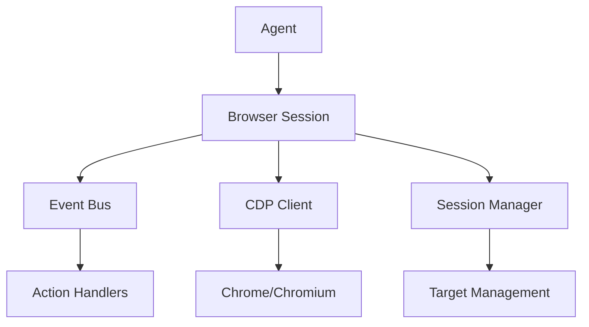
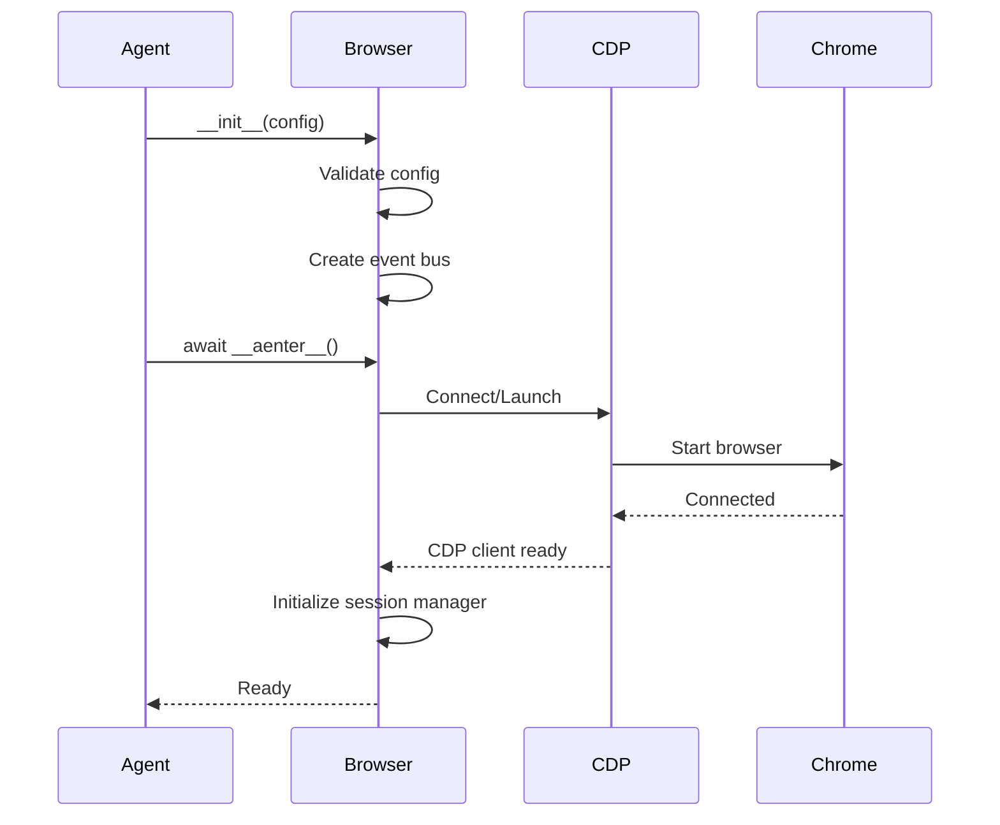

## Overview

The `Browser` (alias for `BrowserSession`) class manages the browser instance and provides both event-driven and imperative interfaces for browser control. It handles browser lifecycle, tab management, page interactions, and state tracking.

<Note>
`Browser` and `BrowserSession` are the same class. Use `Browser` for cleaner, more intuitive code.
</Note>

## Architecture

The browser session uses a 2-layer architecture:



<CardGroup cols={2}>
  <Card title="Event-Driven Layer" icon="bolt">
    High-level events for agents and tools (navigate, click, type, etc.)
  </Card>
  <Card title="CDP Layer" icon="code">
    Direct Chrome DevTools Protocol access for low-level control
  </Card>
  <Card title="Session Manager" icon="diagram-project">
    Manages multiple targets (tabs, iframes) and CDP sessions
  </Card>
  <Card title="State Tracking" icon="chart-line">
    Captures browser state, DOM, and screenshots for the agent
  </Card>
</CardGroup>

## Creating a Browser

### Basic Usage

```python
from browser_use import Browser

# Simplest form - uses defaults
browser = Browser()

# With configuration
browser = Browser(
    headless=False,
    window_size={'width': 1920, 'height': 1080},
)
```

### Browser Modes

<Tabs>
  <Tab title="Local Browser">
    Launch a local Chrome/Chromium instance:
    
    ```python
    browser = Browser(
        headless=False,
        user_data_dir='~/chrome-profile',
        downloads_path='./downloads',
        window_size={'width': 1280, 'height': 720},
    )
    ```
  </Tab>
  
  <Tab title="Cloud Browser">
    Use Browser Use Cloud for production:
    
    ```python
    browser = Browser(
        use_cloud=True,
        cloud_profile_id='your-profile-id',
        cloud_proxy_country_code='us',
        cloud_timeout=30,  # minutes
    )
    ```
    
    <Info>
    Cloud browsers handle authentication, bypass bot detection, and provide the lowest latency for production use.
    </Info>
  </Tab>
  
  <Tab title="Remote CDP">
    Connect to existing browser via CDP:
    
    ```python
    browser = Browser(
        cdp_url="http://localhost:9222",
        headers={'Authorization': 'Bearer token'},
    )
    ```
  </Tab>
  
  <Tab title="Real Browser Profile">
    Use your actual Chrome profile:
    
    ```python
    browser = Browser(
        executable_path='/Applications/Google Chrome.app/Contents/MacOS/Google Chrome',
        user_data_dir='~/Library/Application Support/Google/Chrome',
        profile_directory='Default',
    )
    ```
    
    <Warning>
    Close Chrome completely before using your real profile, or you'll get a lock error.
    </Warning>
  </Tab>
</Tabs>

## Browser Session Lifecycle

### Initialization

The `BrowserSession` class (line 94 in `browser/session.py`) initializes in stages:

```python
class BrowserSession(BaseModel):
    """Event-driven browser session with backwards compatibility."""
    
    id: str  # Unique session identifier
    browser_profile: BrowserProfile  # Configuration
    
    # Private attributes (not serialized)
    _cdp_client_root: CDPClient | None  # Chrome DevTools Protocol client
    _session_manager: SessionManager | None  # Manages tabs and iframes
    _event_bus: EventBus  # Dispatches browser events
```

### Startup Flow



<Info>
Browser initialization is lazy - the actual browser doesn't start until you use it in an async context or call an async method.
</Info>

### Context Manager Usage

```python
from browser_use import Agent, Browser, ChatBrowserUse

async def main():
    async with Browser(headless=False) as browser:
        agent = Agent(
            task="Your task here",
            llm=ChatBrowserUse(),
            browser=browser,
        )
        
        history = await agent.run()
        # Browser automatically closes when exiting context
    
    # Or with manual lifecycle
    browser = Browser()
    try:
        agent = Agent(task="...", llm=llm, browser=browser)
        await agent.run()
    finally:
        await browser.close()
```

## Browser Configuration

### Display Settings

Control how the browser appears:

```python
browser = Browser(
    # Window configuration
    headless=False,  # Show browser window
    window_size={'width': 1920, 'height': 1080},
    window_position={'x': 0, 'y': 0},
    
    # Viewport (content area)
    viewport={'width': 1280, 'height': 720},
    no_viewport=False,  # Disable viewport emulation
    
    # High-resolution screenshots
    device_scale_factor=2.0,  # 2x for retina displays
)
```

<Note>
Set `headless=None` for auto-detection based on display availability (useful for CI/CD).
</Note>

### Security & Domains

Restrict navigation for safety:

```python
browser = Browser(
    allowed_domains=[
        'example.com',        # Exact domain match
        '*.example.com',      # Subdomain wildcard
        'http*://secure.com', # Protocol wildcard
    ],
    prohibited_domains=[
        'malicious-site.com',
        '*.ads-network.net',
    ],
)
```

**Domain Pattern Rules:**
- `'example.com'` → Only `https://example.com/*`
- `'*.example.com'` → Any subdomain including root
- `'http*://example.com'` → Both HTTP and HTTPS
- Wildcards in TLD (e.g., `example.*`) are **not allowed** for security

<Info>
Lists with 100+ domains are automatically optimized to hash sets for O(1) lookup performance.
</Info>

### User Data & Profiles

Persist browser data across sessions:

```python
browser = Browser(
    user_data_dir='./chrome-profile',  # Profile directory
    profile_directory='Profile 1',      # Specific profile name
    
    # Initial cookies/localStorage
    storage_state='auth-state.json',
    # or
    storage_state={
        'cookies': [...],
        'origins': [...],
    },
)
```

### Network Configuration

Control network behavior:

```python
from browser_use.browser import ProxySettings

browser = Browser(
    # Proxy settings
    proxy=ProxySettings(
        server='http://proxy.example.com:8080',
        username='user',
        password='pass',
        bypass='localhost,127.0.0.1',
    ),
    
    # Additional headers
    headers={
        'X-Custom-Header': 'value',
    },
    
    # Permissions
    permissions=['camera', 'microphone', 'geolocation'],
)
```

### Downloads & Files

Configure file handling:

```python
browser = Browser(
    accept_downloads=True,
    downloads_path='./downloads',
    auto_download_pdfs=True,  # Don't open PDFs in viewer
)

# Access downloaded files
downloaded_files = browser.downloaded_files
# ['./downloads/report.pdf', './downloads/data.csv']
```

## Browser Profile

The `BrowserProfile` class (line 44 in `browser/session.py`) encapsulates reusable configuration:

```python
from browser_use.browser import BrowserProfile

# Create reusable profile
profile = BrowserProfile(
    headless=False,
    user_data_dir='./profile',
    window_size={'width': 1920, 'height': 1080},
    allowed_domains=['*.example.com'],
    enable_default_extensions=True,
)

# Use across multiple sessions
browser1 = Browser(browser_profile=profile)
browser2 = Browser(browser_profile=profile)
```

### Profile Components

<Tabs>
  <Tab title="Launch Args">
    Control browser process launch:
    
    ```python
    profile = BrowserProfile(
        executable_path='/path/to/chrome',
        headless=True,
        args=['--disable-gpu', '--no-sandbox'],
        env={'DISPLAY': ':0'},
        channel='chrome',  # or 'chromium', 'msedge'
        chromium_sandbox=True,
        devtools=False,
    )
    ```
  </Tab>
  
  <Tab title="Context Args">
    Configure browser context:
    
    ```python
    profile = BrowserProfile(
        accept_downloads=True,
        permissions=['notifications'],
        user_agent='Custom Agent/1.0',
        viewport={'width': 1280, 'height': 720},
        device_scale_factor=2.0,
    )
    ```
  </Tab>
  
  <Tab title="Recording">
    Enable video/HAR recording:
    
    ```python
    profile = BrowserProfile(
        record_video_dir='./videos',
        record_video_size={'width': 1920, 'height': 1080},
        record_video_framerate=30,
        
        record_har_path='./trace.har',
        record_har_mode='full',
        record_har_content='embed',
    )
    ```
  </Tab>
  
  <Tab title="Timing">
    Control page load behavior:
    
    ```python
    profile = BrowserProfile(
        minimum_wait_page_load_time=0.25,
        wait_for_network_idle_page_load_time=0.5,
        wait_between_actions=0.5,
    )
    ```
  </Tab>
</Tabs>

## Target and Session Management

### Understanding Targets

A **Target** (line 61 in `browser/session.py`) represents a browsing context:

```python
class Target(BaseModel):
    target_id: TargetID  # Unique identifier
    target_type: str     # 'page', 'iframe', 'worker'
    url: str
    title: str
```

Types of targets:
- **Page**: Top-level browser tab
- **Iframe**: Embedded frame within a page
- **Worker**: Service/web worker
- **Background**: Extension background page

### CDP Sessions

A **CDPSession** (line 76 in `browser/session.py`) is a communication channel:

```python
class CDPSession(BaseModel):
    cdp_client: CDPClient  # Chrome DevTools Protocol client
    target_id: TargetID    # Which target this controls
    session_id: SessionID  # Unique session ID
```

### Tab Management

```python
# Get all tabs
tabs = await browser.get_tabs()
for tab in tabs:
    print(f"Tab {tab.target_id[-4:]}: {tab.title}")

# Switch to specific tab
await browser.switch_to_tab(target_id)

# Close tab
await browser.close_tab(target_id)

# Get current page
page = await browser.get_current_page()
```

## Browser State Capture

### State Summary

The agent uses `get_browser_state_summary()` to understand the page:

```python
state = await browser.get_browser_state_summary(
    include_screenshot=True,
    include_recent_events=True,
)

# State includes:
state.url                    # Current URL
state.title                  # Page title
state.screenshot             # Base64 screenshot
state.tabs                   # List of open tabs
state.interacted_elements    # Recently clicked elements
state.clickable_elements_text # Interactive elements for LLM
```

### DOM State Structure

```python
from browser_use.browser.views import BrowserStateSummary

@dataclass
class BrowserStateSummary:
    url: str
    title: str
    tabs: list[TabInfo]
    interacted_elements: list[DOMInteractedElement]
    clickable_elements_text: str  # Formatted for LLM
    selector_map: DOMSelectorMap  # index -> DOMNode mapping
    screenshot: str | None         # Base64 PNG
    screenshot_metadata: dict | None
```

## Browser Events

The event bus handles browser actions:

### Navigation Events

```python
from browser_use.browser.events import NavigateToUrlEvent

# Dispatch navigation
event = browser.event_bus.dispatch(
    NavigateToUrlEvent(url='https://example.com', new_tab=False)
)
await event
result = await event.event_result()
```

### Available Events

<CardGroup cols={2}>
  <Card title="NavigateToUrlEvent" icon="arrow-right">
    Navigate to URL (optionally in new tab)
  </Card>
  <Card title="ClickElementEvent" icon="hand-pointer">
    Click element by DOM node
  </Card>
  <Card title="TypeTextEvent" icon="keyboard">
    Type text into input field
  </Card>
  <Card title="ScrollEvent" icon="arrows-up-down">
    Scroll page or element
  </Card>
  <Card title="SwitchTabEvent" icon="window-restore">
    Switch to different tab
  </Card>
  <Card title="CloseTabEvent" icon="xmark">
    Close a browser tab
  </Card>
  <Card title="UploadFileEvent" icon="upload">
    Upload file to input[type=file]
  </Card>
  <Card title="GoBackEvent" icon="arrow-left">
    Navigate back in history
  </Card>
</CardGroup>

## Actor Integration

The browser provides direct access to the [Actor](/customize/actor/basics) API for deterministic automation:

```python
# Get page actor for direct control
page = await browser.get_current_page()

# Direct element interactions
element = await page.query_selector('button.submit')
await element.click()

# Direct navigation
await page.navigate('https://example.com')

# JavaScript execution
result = await page.evaluate('document.title')

# Screenshots
await page.screenshot(path='screenshot.png')
```

<Info>
The Actor API provides Playwright-like methods for precise browser control. See [Actor documentation](/customize/actor/all-methods) for complete reference.
</Info>

## Advanced Features

### Element Highlighting

Visual feedback for debugging:

```python
browser = Browser(
    highlight_elements=True,  # Highlight clickable elements
    dom_highlight_elements=True,  # DOM-level highlighting
)

# Programmatic highlighting
await browser.highlight_interaction_element(node)
await browser.highlight_coordinate_click(x, y)
```

### Cross-Origin Iframes

Enable iframe support (may add complexity):

```python
browser = Browser(
    cross_origin_iframes=True,
    max_iframes=10,
    max_iframe_depth=3,
)
```

### Paint Order Filtering

Optimize DOM by removing hidden elements:

```python
browser = Browser(
    paint_order_filtering=True,  # Remove elements behind others
)
```

<Note>
Paint order filtering is experimental but can significantly reduce DOM size by removing occluded elements.
</Note>

### Demo Mode

Visual agent panel for live viewing:

```python
browser = Browser(
    demo_mode=True,  # Shows in-browser control panel
    headless=False,  # Required for demo mode
)
```

## Cookie Management

### Getting Cookies

```python
# Get all cookies
cookies = await browser.cookies()

# Get cookies for specific URL
cookies = await browser.cookies(urls=['https://example.com'])

# Cookie structure
for cookie in cookies:
    print(f"{cookie['name']}: {cookie['value']}")
    print(f"Domain: {cookie['domain']}")
```

### Setting Cookies

```python
from cdp_use.cdp.network import CookieParam

await browser.set_cookies([
    CookieParam(
        name='session_id',
        value='abc123',
        domain='example.com',
        path='/',
        secure=True,
        httpOnly=True,
    )
])
```

## Real-World Example

```python
from browser_use import Browser
from browser_use.browser import ProxySettings
import asyncio

async def main():
    # Production-ready browser configuration
    browser = Browser(
        # Display
        headless=False,
        window_size={'width': 1920, 'height': 1080},
        
        # Security
        allowed_domains=[
            '*.amazon.com',
            '*.google.com',
        ],
        
        # Network
        proxy=ProxySettings(server='http://proxy:8080'),
        
        # Downloads
        accept_downloads=True,
        downloads_path='./data/downloads',
        auto_download_pdfs=True,
        
        # Performance
        minimum_wait_page_load_time=0.3,
        wait_for_network_idle_page_load_time=0.5,
        
        # Features
        highlight_elements=True,
        paint_order_filtering=True,
        
        # Recording (for debugging)
        record_video_dir='./recordings',
        record_har_path='./trace.har',
    )
    
    async with browser:
        # Use with agent or directly
        page = await browser.get_current_page()
        await page.navigate('https://example.com')
        
        state = await browser.get_browser_state_summary(
            include_screenshot=True
        )
        
        print(f"Loaded: {state.title}")
        print(f"Tabs: {len(state.tabs)}")
        print(f"Interactive elements: {len(state.selector_map)}")

if __name__ == "__main__":
    asyncio.run(main())
```

## Performance Tips

<Tabs>
  <Tab title="Optimize Screenshots">
    ```python
    browser = Browser(
        device_scale_factor=1.0,  # Lower for speed
        llm_screenshot_size=(1280, 720),  # Resize before LLM
    )
    ```
  </Tab>
  
  <Tab title="Reduce DOM Size">
    ```python
    browser = Browser(
        paint_order_filtering=True,  # Remove hidden elements
        max_iframes=5,  # Limit iframe processing
        max_iframe_depth=2,
    )
    ```
  </Tab>
  
  <Tab title="Speed Up Navigation">
    ```python
    browser = Browser(
        minimum_wait_page_load_time=0.1,  # Faster page loads
        wait_for_network_idle_page_load_time=0.3,
    )
    ```
  </Tab>
</Tabs>

## Troubleshooting

### Common Issues

<AccordionGroup>
  <Accordion title="Browser won't start">
    **Check:**
    - Chromium installed: `uvx browser-use install`
    - Correct executable path if using custom browser
    - User data directory not locked by another process
  </Accordion>
  
  <Accordion title="Connection timeout">
    **Solutions:**
    - Increase CDP timeout
    - Check firewall/network settings
    - Verify CDP URL is accessible
  </Accordion>
  
  <Accordion title="Element not found">
    **Debug:**
    - Enable `highlight_elements=True`
    - Check page has fully loaded
    - Verify element is not in iframe
  </Accordion>
</AccordionGroup>

## Next Steps

<CardGroup cols={2}>
  <Card title="Tools System" icon="wrench" href="/concepts/tools">
    Learn about browser actions and tools
  </Card>
  <Card title="Actor API" icon="play" href="/customize/actor/basics">
    Direct browser control methods
  </Card>
  <Card title="Browser Parameters" icon="sliders" href="/customize/browser/all-parameters">
    Complete parameter reference
  </Card>
  <Card title="Cloud Browser" icon="cloud" href="/customize/browser/remote">
    Production deployment with cloud browsers
  </Card>
</CardGroup>
