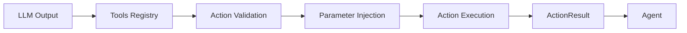

## Overview

The **Tools** system is the bridge between the LLM and browser actions. It provides a registry of actions the agent can perform, handles parameter validation, and manages action execution. Each tool is a function that the LLM can call to interact with the web.

## Architecture



<CardGroup cols={2}>
  <Card title="Registry" icon="book">
    Centralized catalog of available actions
  </Card>
  <Card title="Action Models" icon="shapes">
    Pydantic models for type-safe parameters
  </Card>
  <Card title="Parameter Injection" icon="syringe">
    Automatic dependency injection from context
  </Card>
  <Card title="Result Handling" icon="check-circle">
    Structured responses with ActionResult
  </Card>
</CardGroup>

## The Tools Class

The `Tools` class (line 345 in `tools/service.py`) manages the action registry:

```python
class Tools(Generic[Context]):
    def __init__(
        self,
        exclude_actions: list[str] | None = None,
        output_model: type[T] | None = None,
        display_files_in_done_text: bool = True,
    ):
        self.registry = Registry[Context](exclude_actions or [])
        self._output_model = output_model
        self._coordinate_clicking_enabled = False
```

### Creating a Tools Instance

```python
from browser_use import Tools

# Default tools (all actions)
tools = Tools()

# Exclude specific actions
tools = Tools(exclude_actions=['search', 'wait'])

# With structured output model
from pydantic import BaseModel

class ProductInfo(BaseModel):
    name: str
    price: float
    rating: float

tools = Tools(output_model=ProductInfo)
```

## Default Browser Actions

### Navigation Actions

<Tabs>
  <Tab title="search">
    **Search the web using a search engine**
    
    ```python
    # LLM can call:
    {
        "search": {
            "query": "browser automation python",
            "engine": "duckduckgo"  # or "google", "bing"
        }
    }
    ```
    
    Implementation (line 362 in `tools/service.py`):
    - Encodes query for URL safety
    - Constructs search URL for specified engine
    - Navigates to search results
    - Returns: `"Searched {engine} for '{query}'"`
  </Tab>
  
  <Tab title="navigate">
    **Navigate to a specific URL**
    
    ```python
    # LLM can call:
    {
        "navigate": {
            "url": "https://example.com",
            "new_tab": false
        }
    }
    ```
    
    Implementation (line 406):
    - Validates URL format
    - Dispatches NavigateToUrlEvent
    - Handles network errors gracefully
    - Returns: `"Navigated to {url}"` or error
  </Tab>
  
  <Tab title="go_back">
    **Go back in browser history**
    
    ```python
    # LLM can call:
    {
        "go_back": {}
    }
    ```
    
    Implementation (line 454):
    - Simple history navigation
    - Returns: `"Navigated back"`
  </Tab>
</Tabs>

### Interaction Actions

<Tabs>
  <Tab title="click">
    **Click an element by index or coordinate**
    
    ```python
    # By index (element from selector_map)
    {
        "click": {
            "index": 42
        }
    }
    
    # By coordinate (advanced models only)
    {
        "click": {
            "coordinate_x": 500,
            "coordinate_y": 300
        }
    }
    ```
    
    Implementation (line 565 for index, line 521 for coordinate):
    - Looks up element from selector_map
    - Highlights element visually
    - Detects if click opens new tab
    - Handles special cases (dropdowns, file inputs)
    - Returns: `"Clicked {element_description}"`
    
    <Note>
    Coordinate clicking is auto-enabled for Claude Sonnet 4, Claude Opus 4, Gemini 3 Pro, and Browser Use models.
    </Note>
  </Tab>
  
  <Tab title="input">
    **Type text into an input field**
    
    ```python
    {
        "input": {
            "index": 15,
            "text": "Hello world",
            "clear": true  # Clear existing text first
        }
    }
    ```
    
    Implementation (line 635):
    - Validates element is an input field
    - Clears field if `clear=true`
    - Types text character by character
    - Detects autocomplete fields
    - Handles sensitive data masking
    - Returns: `"Typed '{text}'"` or `"Typed <sensitive>"`
    
    <Info>
    Autocomplete fields automatically wait 400ms for dropdown suggestions to appear.
    </Info>
  </Tab>
  
  <Tab title="scroll">
    **Scroll page or element**
    
    ```python
    {
        "scroll": {
            "down": true,  # or false for up
            "pages": 1.5,  # scroll amount
            "index": null  # null for page, or element index
        }
    }
    ```
    
    Implementation (line 1237):
    - Auto-detects viewport height
    - Scrolls by full pages (viewport height)
    - Supports fractional pages
    - Can scroll specific elements
    - Returns: `"Scrolled {direction} {pages} pages"`
  </Tab>
  
  <Tab title="send_keys">
    **Send keyboard keys**
    
    ```python
    {
        "send_keys": {
            "keys": "Tab Tab Enter"  # Space-separated keys
        }
    }
    ```
    
    Supported keys: Enter, Tab, Escape, ArrowUp, ArrowDown, ArrowLeft, ArrowRight, Backspace, Delete
    
    Returns: `"Sent keys: {keys}"`
  </Tab>
</Tabs>

### Content Extraction

<Tabs>
  <Tab title="extract">
    **Extract structured data from page using LLM**
    
    ```python
    {
        "extract": {
            "query": "Extract product names and prices",
            "extract_links": true,
            "start_from_char": 0,  # For pagination
            "output_schema": {  # Optional structured output
                "type": "object",
                "properties": {
                    "products": {
                        "type": "array",
                        "items": {
                            "type": "object",
                            "properties": {
                                "name": {"type": "string"},
                                "price": {"type": "number"}
                            }
                        }
                    }
                }
            }
        }
    }
    ```
    
    Implementation (line 947):
    1. Extracts clean markdown from page (removes ads/noise)
    2. Chunks content if over 100k chars
    3. Calls page_extraction_llm with query
    4. Returns structured or free-text result
    5. Saves to file if result is large
    
    **Content Processing:**
    - Original HTML → Initial Markdown → Filtered Markdown
    - Structure-aware chunking (preserves tables, lists)
    - Overlap context for continuation chunks
    - Stats included in response
    
    Returns: `<url>...</url><query>...</query><result>...</result>`
  </Tab>
  
  <Tab title="search_page">
    **Search page text (like grep) - zero LLM cost**
    
    ```python
    {
        "search_page": {
            "pattern": "error|warning",
            "regex": true,
            "case_sensitive": false,
            "context_chars": 100,
            "css_scope": null,  # Optional CSS selector to limit scope
            "max_results": 20
        }
    }
    ```
    
    Implementation (line 1165):
    - Pure JavaScript execution in browser
    - No LLM call required
    - Returns matches with surrounding context
    - Shows element paths for each match
    
    Use cases: Find specific text, verify content, locate errors
  </Tab>
  
  <Tab title="find_elements">
    **Query DOM elements (like find) - zero LLM cost**
    
    ```python
    {
        "find_elements": {
            "selector": "button.primary",
            "attributes": ["href", "src", "data-id"],
            "include_text": true,
            "max_results": 50
        }
    }
    ```
    
    Implementation (line 1202):
    - Pure JavaScript querySelectorAll
    - No LLM call required
    - Returns element details with attributes
    
    Use cases: Count items, get links, explore page structure
  </Tab>
</Tabs>

### Tab Management

<Tabs>
  <Tab title="switch">
    **Switch to another tab**
    
    ```python
    {
        "switch": {
            "tab_id": "a1b2"  # Last 4 chars of target_id
        }
    }
    ```
    
    Returns: `"Switched to tab #{tab_id}"`
  </Tab>
  
  <Tab title="close">
    **Close a browser tab**
    
    ```python
    {
        "close": {
            "tab_id": "a1b2"
        }
    }
    ```
    
    Returns: `"Closed tab #{tab_id}"`
  </Tab>
</Tabs>

### File Operations

<Tabs>
  <Tab title="upload_file">
    **Upload file to input[type=file]**
    
    ```python
    {
        "upload_file": {
            "index": 10,  # File input element index
            "path": "/path/to/file.pdf"
        }
    }
    ```
    
    Implementation (line 721):
    - Validates file exists and has content
    - Finds file input near selected element
    - Falls back to closest file input to scroll position
    - Returns: `"Successfully uploaded file"`
    
    <Warning>
    Files must be in `available_file_paths` parameter when creating the agent.
    </Warning>
  </Tab>
  
  <Tab title="write_file">
    **Write content to file**
    
    ```python
    {
        "write_file": {
            "path": "output.txt",
            "content": "Hello world"
        }
    }
    ```
    
    Uses agent's FileSystem service to create files in workspace.
  </Tab>
  
  <Tab title="read_file">
    **Read file contents**
    
    ```python
    {
        "read_file": {
            "path": "data.txt"
        }
    }
    ```
    
    Reads from agent's FileSystem workspace.
  </Tab>
</Tabs>

### Form Controls

<Tabs>
  <Tab title="dropdown_options">
    **Get dropdown options**
    
    ```python
    {
        "dropdown_options": {
            "index": 8  # Select element index
        }
    }
    ```
    
    Returns all options with values and text.
  </Tab>
  
  <Tab title="select_dropdown">
    **Select dropdown option**
    
    ```python
    {
        "select_dropdown": {
            "index": 8,
            "value": "option-value"  # or text
        }
    }
    ```
    
    Selects option by value or visible text.
  </Tab>
</Tabs>

### Completion

<Tabs>
  <Tab title="done">
    **Complete the task**
    
    ```python
    {
        "done": {
            "success": true,
            "text": "Successfully extracted 5 products",
            "attachments": ["products.csv"]  # Optional file paths
        }
    }
    ```
    
    Signals task completion with final output.
  </Tab>
  
  <Tab title="screenshot">
    **Request screenshot in next browser state**
    
    ```python
    {
        "screenshot": {}
    }
    ```
    
    Only available when `use_vision='auto'`. Requests a screenshot for visual confirmation.
  </Tab>
</Tabs>

## Creating Custom Tools

### Basic Custom Tool

```python
from browser_use import Tools, ActionResult

tools = Tools()

@tools.action('Ask human for help with a question')
async def ask_human(question: str) -> ActionResult:
    """Human-in-the-loop tool."""
    answer = input(f'\n{question}\n> ')
    return ActionResult(
        extracted_content=f'Human answered: {answer}'
    )
```

### Tool with Browser Access

<Warning>
**Critical**: The parameter must be named exactly `browser_session` with type `BrowserSession`. Parameter injection works by **name matching**.
</Warning>

```python
from browser_use import BrowserSession, ActionResult

@tools.action('Get current page title deterministically')
async def get_title(browser_session: BrowserSession) -> ActionResult:
    """Access browser directly for deterministic actions."""
    page = await browser_session.get_current_page()
    title = await page.evaluate('document.title')
    return ActionResult(extracted_content=f'Title: {title}')
```

### Tool with Multiple Injections

Available injectable parameters (line 77 in `tools/service.py`):

```python
@tools.action('Advanced tool with all context')
async def advanced_tool(
    # Your parameters
    query: str,
    max_results: int = 10,
    
    # Injected by agent (name-based matching)
    browser_session: BrowserSession,
    file_system: FileSystem,
    page_extraction_llm: BaseChatModel,
    available_file_paths: list[str],
    has_sensitive_data: bool,
    sensitive_data: dict[str, str | dict[str, str]] | None,
    extraction_schema: dict | None,
) -> ActionResult:
    """Tool with full agent context access."""
    
    # Use browser
    state = await browser_session.get_browser_state_summary()
    
    # Use file system
    file_system.write_file('output.txt', 'data')
    
    # Use extraction LLM
    response = await page_extraction_llm.ainvoke([...])
    
    return ActionResult(extracted_content='Result')
```

### Domain-Restricted Tools

```python
@tools.action(
    'Login to example.com with credentials',
    allowed_domains=['*.example.com', 'auth.example.com']
)
async def login(username: str, password: str, browser_session: BrowserSession):
    """Only callable on example.com domains."""
    page = await browser_session.get_current_page()
    # ... login logic
    return ActionResult(extracted_content='Logged in successfully')
```

## ActionResult Response

The `ActionResult` class structures tool responses:

```python
from browser_use.agent.views import ActionResult

# Simple success
ActionResult(extracted_content="Found 5 products")

# With error
ActionResult(error="Failed to load page: timeout")

# Task completion
ActionResult(
    extracted_content="Task completed",
    is_done=True,
    success=True,
    attachments=["report.pdf", "data.csv"]
)

# With metadata
ActionResult(
    extracted_content="Clicked button",
    metadata={'click_x': 500, 'click_y': 300}
)

# With memory
ActionResult(
    extracted_content="Long result text...",
    long_term_memory="Short summary for agent memory",
    include_extracted_content_only_once=True
)
```

**ActionResult Fields:**
- `extracted_content`: Main result text (shown to agent)
- `error`: Error message if action failed
- `is_done`: Mark task as complete
- `success`: Whether task succeeded (for done action)
- `attachments`: List of file paths
- `metadata`: Additional structured data
- `long_term_memory`: Summary for agent's memory
- `include_extracted_content_only_once`: Show full content once, use memory after

## Parameter Injection System

The tools system automatically injects context based on parameter names:

```python
# Parameter name -> Injected value
browser_session: BrowserSession  → Current browser session
file_system: FileSystem          → Agent's file system
page_extraction_llm: BaseChatModel → Extraction LLM
available_file_paths: list[str]  → Available files
has_sensitive_data: bool         → Whether sensitive data exists
sensitive_data: dict             → Sensitive data mapping
extraction_schema: dict          → Structured output schema
```

<Info>
The injection happens at execution time, not registration. You don't need to pass these values when registering tools.
</Info>

## Tools Registry

The `Registry` class manages action registration:

```python
from browser_use.tools.registry.service import Registry

registry = Registry()

# Register action
@registry.action(
    description='My custom action',
    param_model=MyParamModel,
    terminates_sequence=False,  # Whether action ends multi-action sequence
)
async def my_action(params: MyParamModel) -> ActionResult:
    return ActionResult(extracted_content='Done')

# Get prompt description (for LLM)
prompt = registry.get_prompt_description(url='https://example.com')

# Create dynamic action model
ActionModel = registry.create_action_model(
    include_actions=['click', 'input', 'done'],
    exclude_actions=['search']
)
```

## Excluding Default Actions

Remove actions you don't need:

```python
tools = Tools(exclude_actions=[
    'search',        # Don't allow web searches
    'wait',          # Don't allow waiting
    'screenshot',    # Don't allow screenshot requests
    'upload_file',   # Don't allow file uploads
])
```

Common exclusions:
- `screenshot`: When `use_vision != 'auto'`
- `search`: For domain-restricted tasks
- `upload_file`: For read-only tasks

## Coordinate Clicking

Enable coordinate-based clicking for advanced models:

```python
tools = Tools()
tools.set_coordinate_clicking(True)

# Now agent can click by pixel coordinates
# Automatically enabled for: Claude Sonnet 4, Claude Opus 4, Gemini 3 Pro, Browser Use models
```

When enabled, click action accepts coordinates:
```python
{
    "click": {
        "coordinate_x": 500,
        "coordinate_y": 300
    }
}
```

## Structured Output Integration

Define expected output format:

```python
from pydantic import BaseModel

class SearchResult(BaseModel):
    title: str
    url: str
    snippet: str

class SearchResults(BaseModel):
    results: list[SearchResult]
    total_count: int

tools = Tools(output_model=SearchResults)

# Agent now has a 'structured_output' action
# LLM will call it when task is complete:
# {
#     "structured_output": {
#         "results": [...],
#         "total_count": 10
#     }
# }
```

## Real-World Examples

### Human-in-the-Loop

```python
from browser_use import Tools, Agent, ChatBrowserUse, ActionResult

tools = Tools()

@tools.action('Ask human for 2FA code')
async def get_2fa_code() -> ActionResult:
    """Get 2FA code from user."""
    code = input('Enter 2FA code: ')
    return ActionResult(extracted_content=f'2FA code: {code}')

agent = Agent(
    task="""
    1. Go to example.com/login
    2. Enter username and password
    3. Use get_2fa_code action to get 2FA code
    4. Complete login
    """,
    llm=ChatBrowserUse(),
    tools=tools,
)
```

### API Integration

```python
import httpx

@tools.action('Fetch product data from external API')
async def fetch_product_data(product_id: str) -> ActionResult:
    """Call external API for product information."""
    async with httpx.AsyncClient() as client:
        response = await client.get(
            f'https://api.example.com/products/{product_id}'
        )
        data = response.json()
        
    return ActionResult(
        extracted_content=f"Product: {data['name']}, Price: ${data['price']}"
    )
```

### Database Access

```python
import asyncpg

@tools.action('Save scraped data to database')
async def save_to_db(
    product_name: str,
    price: float,
    rating: float
) -> ActionResult:
    """Store extracted data in PostgreSQL."""
    conn = await asyncpg.connect('postgresql://localhost/mydb')
    
    await conn.execute(
        'INSERT INTO products (name, price, rating) VALUES ($1, $2, $3)',
        product_name, price, rating
    )
    
    await conn.close()
    return ActionResult(extracted_content='Saved to database')
```

### Deterministic Automation

```python
from browser_use import BrowserSession, ActionResult

@tools.action('Fill form deterministically with Playwright-like API')
async def fill_complex_form(
    browser_session: BrowserSession
) -> ActionResult:
    """Use Actor API for precise form filling."""
    page = await browser_session.get_current_page()
    
    # Deterministic element selection and interaction
    await page.click('button[data-test="login"]')
    await page.wait_for_selector('input[name="email"]')
    await page.fill('input[name="email"]', 'user@example.com')
    await page.fill('input[name="password"]', 'secret123')
    await page.click('button[type="submit"]')
    
    # Wait for navigation
    await page.wait_for_url('**/dashboard')
    
    return ActionResult(extracted_content='Form filled and submitted')
```

## Performance Considerations

<Tabs>
  <Tab title="Zero-Cost Tools">
    Use `search_page` and `find_elements` for fast, LLM-free lookups:
    
    ```python
    # Instead of extract, use search_page for simple queries
    {
        "search_page": {
            "pattern": "\\$\\d+\\.\\d{2}",  # Find prices
            "regex": true
        }
    }
    ```
  </Tab>
  
  <Tab title="Batch Actions">
    Group related actions to reduce steps:
    
    ```python
    # Agent can execute up to max_actions_per_step at once
    agent = Agent(
        task="Fill multi-field form",
        llm=llm,
        max_actions_per_step=5,  # Execute 5 input actions together
    )
    ```
  </Tab>
  
  <Tab title="Streaming Results">
    For large extractions, use file system:
    
    ```python
    @tools.action('Extract large dataset')
    async def extract_large(
        file_system: FileSystem,
        browser_session: BrowserSession
    ) -> ActionResult:
        # Extract data
        data = await extract_data(browser_session)
        
        # Save to file instead of returning in content
        file_name = file_system.write_file('data.csv', data)
        
        return ActionResult(
            extracted_content=f'Data saved to {file_name}',
            long_term_memory='Extracted large dataset to data.csv'
        )
    ```
  </Tab>
</Tabs>

## Troubleshooting

<AccordionGroup>
  <Accordion title="Tool not being called">
    **Check:**
    - Tool description is clear and specific
    - Parameter types are correct
    - Tool isn't excluded in Tools(exclude_actions=[...])
    - Domain restrictions don't block current page
  </Accordion>
  
  <Accordion title="Parameter injection fails">
    **Verify:**
    - Parameter name matches exactly (e.g., `browser_session`)
    - Type hint is correct (e.g., `BrowserSession`)
    - Parameter is available in current context
  </Accordion>
  
  <Accordion title="ActionResult not working">
    **Ensure:**
    - Return type is ActionResult or str
    - Don't raise exceptions, return ActionResult(error='...')
    - Use proper field names (extracted_content, not content)
  </Accordion>
</AccordionGroup>

## Next Steps

<CardGroup cols={2}>
  <Card title="Available Tools" icon="list" href="/customize/tools/available">
    Complete list of default actions
  </Card>
  <Card title="Add Custom Tools" icon="plus" href="/customize/tools/add">
    Detailed guide to creating tools
  </Card>
  <Card title="Tool Response" icon="reply" href="/customize/tools/response">
    Advanced ActionResult patterns
  </Card>
  <Card title="Actor API" icon="play" href="/customize/actor/basics">
    Playwright-like browser control
  </Card>
</CardGroup>
